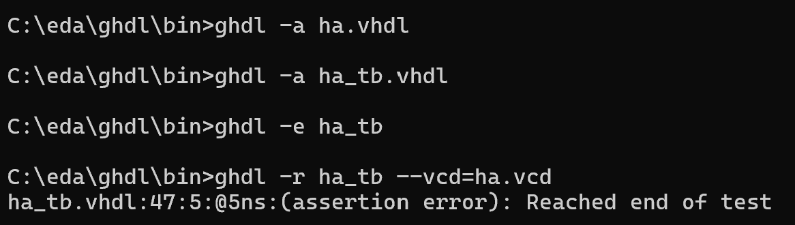
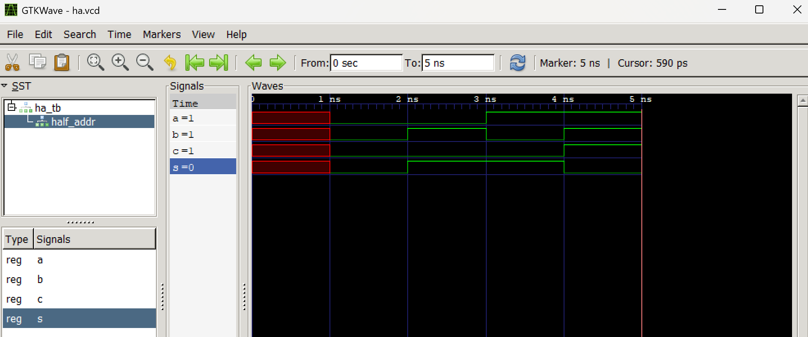

# CPE 322 - Lab 1 
## GHDL and GTKWave 
--- 
### Installation 

Following the instructions for installing the GHDL and GTKWave software functioned as intended, as both pieces of software were downloaded, extracted, and placed in the proper folders to function. After these instructions were completed, a Windows command utility was opened, and the programs' executable files were invoked through the command line to run the two examples. 

### Part 1: Half Adder Example 

The first set of files to be tested was the Half Adder example, which included ha.vhdl and ha_tb.vhdl. These files model and test a simple half adder component by modifying the values of the input signals. The signals a and b are used as inputs, and the output signals, s and c, are generated using the standard function of a half adder, in which s takes the value of a XOR b, while c takes the value of a AND b. 

The proper GHDL commands were invoked via the command line to run the simulation test bench for this half adder and generate the output wave signal file. 

 

The test bench modified the values of the inputs to fully test the system, and the responses through the output signals were simulated as a result. The generated waveforms demonstrated these results, which make sense based on the description of a standard half adder. They were displayed in GTKWave using the command line, similarly to the usage of GHDL. 

 

The signals all begin undefined, but when a and b are set to 0, s and c are also 0. When only b is set to 1, s becomes 1, and when only a is set to 1, s is also 1. By setting both a and b to 1, s becomes 0 again, with c becoming 1. This matches the implementation of a half adder, as c is only 1 when a and b are 1, while s is only 1 when either a or b are 1, but not both. 

### Part 2: D Flip-Flop Example 

