# CPE 322 - Lab 10 
## Blockchain 
--- 
### Part 1: SnakeCoin 

This lab began by running the file `hash_value.py` twice and comparing the results it provides. The file hashed the first 3 numerical values the same both times, but the other 3 values were hashed differently, indicating the presence of randomization in the hashing process for object types. 

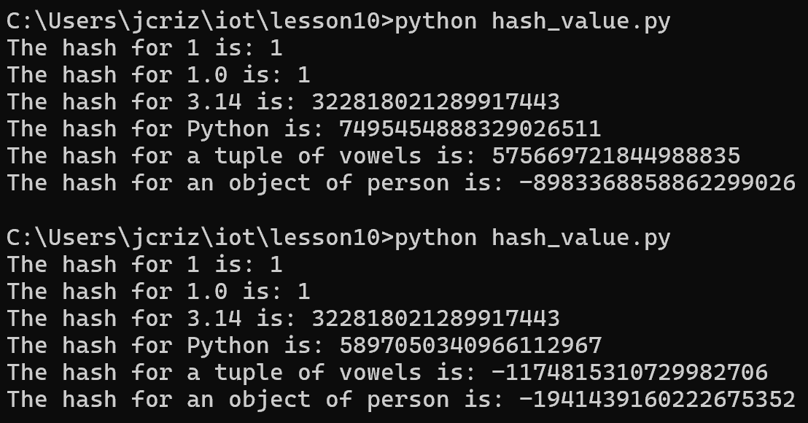 

The next file tested was `snakecoin.py`, a very simple implementation of a blockchain. Running the file produces a simple blockchain, in which 20 blocks are mined and their hashes are printed. 

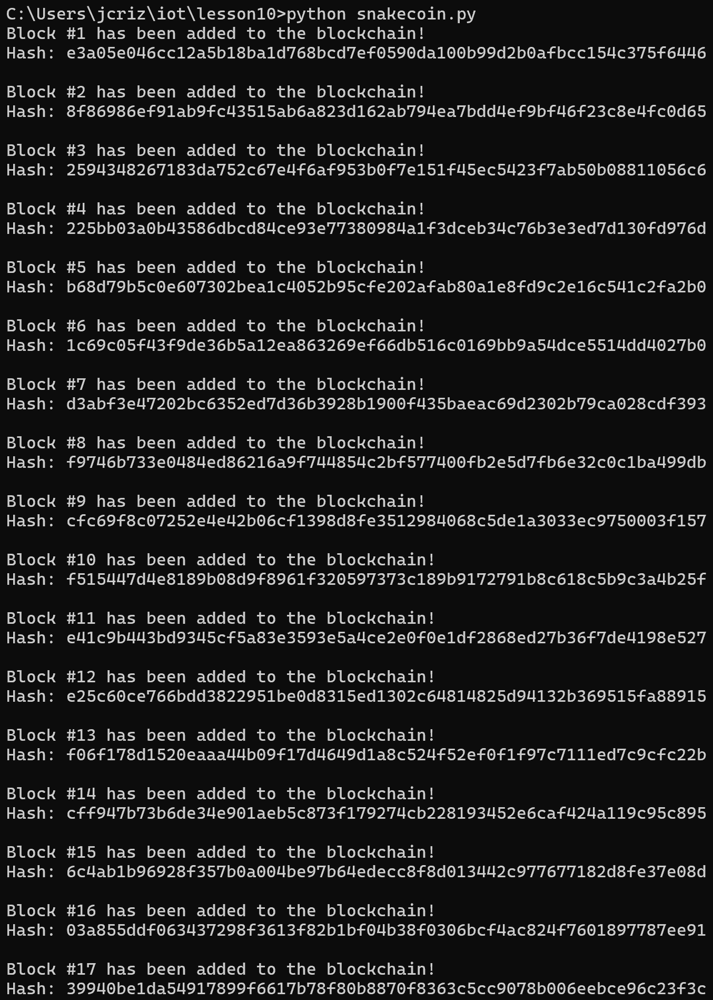 

The next iteration of the SnakeCoin project ran through the file `snakecoin-server-full-code.py`, which runs a Flask server when executed. This server allowed blocks to be mined by accessing its "mine" page. The server simply produced a webpage that identified itself as a SnakeCoin server when viewed. 

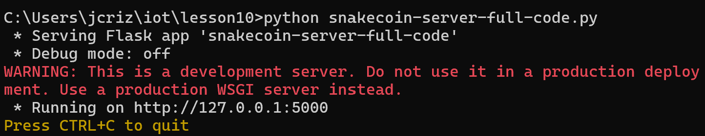 

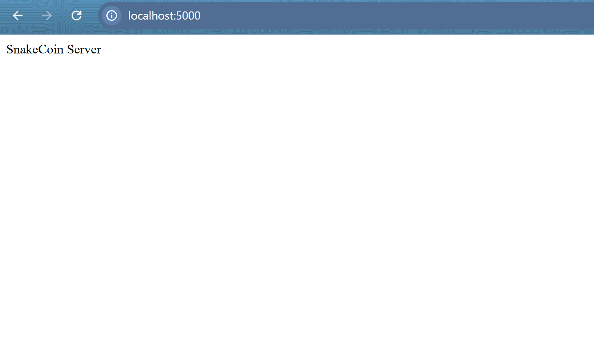 

Another terminal was opened, and a block was mined on it. It is notable that the "curl" command was rejected by the server from the Windows terminal, so an Msys2 terminal was used instead, which did work properly, and the blockchain was initialized with a block mined. 

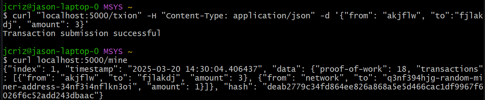 

Blocks could also be mined by accessing the page through a browser directly. 

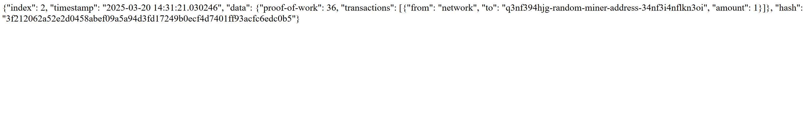 

### Part 2: Python Blockchain App 

The second portion of this lab focused on a more specific application of blockchain running on two different servers in the terminal. 

The necessary Python files were cloned using the "git clone" command, which was successful. 

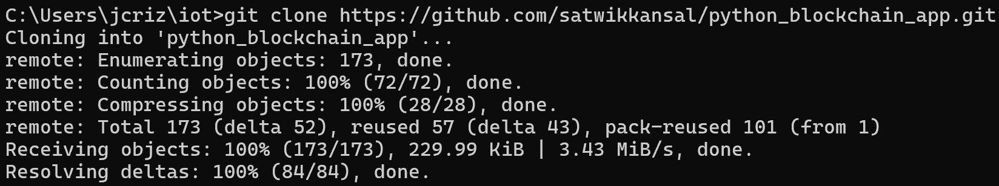 

The app was then executed from the cloned folder, with two files being used. `node_server.py` was executed first to host the blockchain, then `run_app.py` was executed to host the content sharing application server that interacted with the blockchain. 

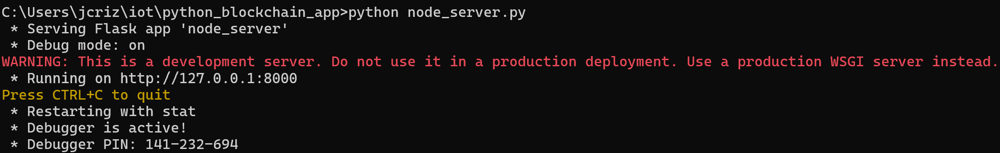 

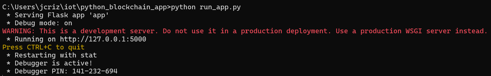 

To use this app, a message with a name could be posted into a text box on the app webpage. The message would not be viewable until stored in the blockchain, however, so the "Request to Mine" button needed to be pressed first. Afterwards, the block was mined, and the posted messages were added to the blockchain and stored on the webpage. 

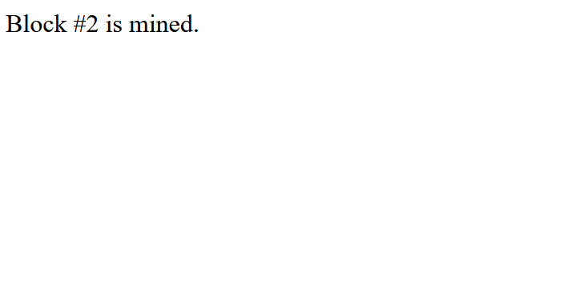 

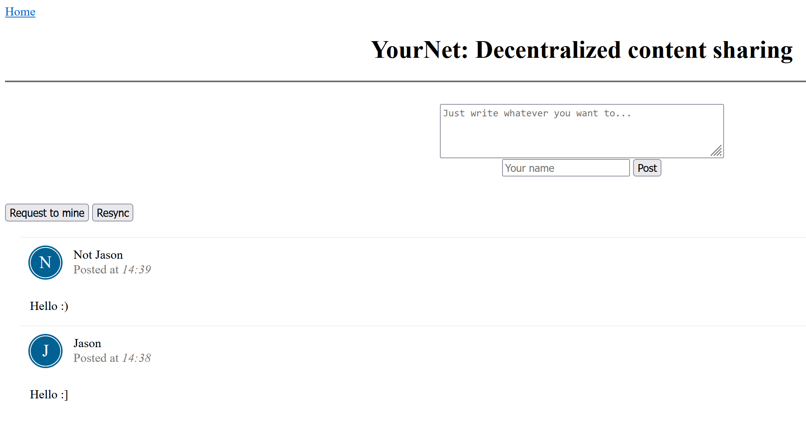 

