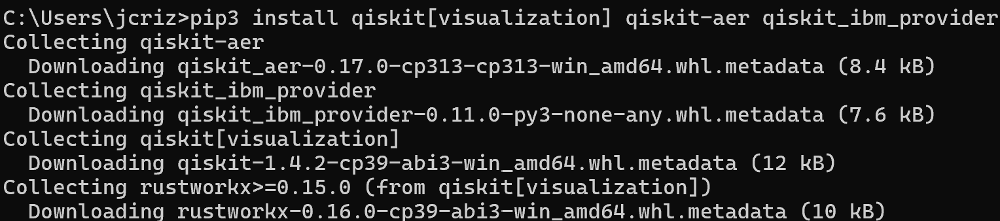
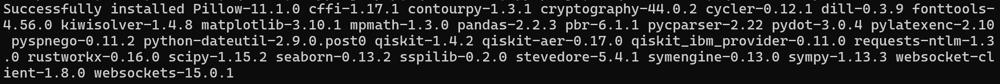
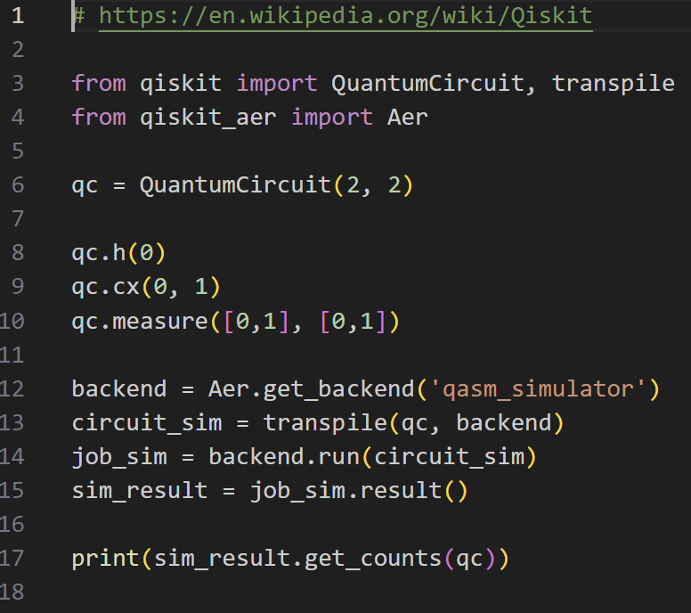
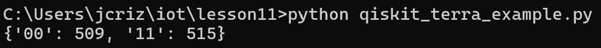
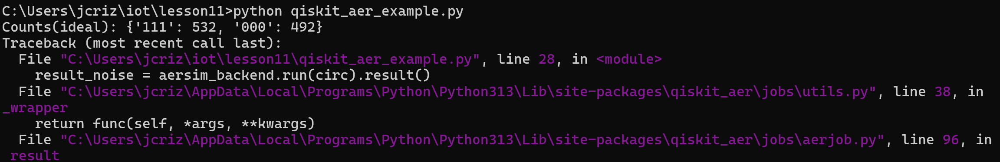

# CPE 322 - Lab 11 
## Qiskit 
--- 
### Installation 

This lab began by installing the required Python packages to use Qiskit, the IBM Quantum Information Software Kit. These were installed using pip, as with all other Python packages. This installation was successful, although the package `qiskit_ibm_runtime` had to be installed additionally to attempt to resolve several function deprecation issues. 

 

 

After the software was successfully installed, an IBM Quantum Computing account was created to allow the Python scripts tested to access the quantum computing APIs provided by IBM. The API key was accessible once the account was created and logged in, and it was copied into a Python command line instance to set it as the usable API key for the Qiskit functions. 

The first file tested was `qiskit_terra_example.py`, which modeled a simple quantum circuit using Qiskit's API. The file needed to be modified in order to run, as according to [IBM documentation](https://docs.quantum.ibm.com/migration-guides/qiskit-1.0-features#execute), the function running the quantum circuit had been updated in more recent versions of Qiskit, and the older functions were deprecated. Thus, modifiecations needed to be made to the imports and functions within the Terra example, which are shown. Instead of bein executed directly, the circuit needed to be transpiled, then run on the backend object to generate the array of results. After these edits were completed, the program ran properly. 

 

 

The program generated an array showing that the two qubits were both 0 509 times, and that they were both 1 515 times, indicating that the circuit was tested for 1024 trials and that the qubits were always set to the same values, but had an approximately equal probability of being 0 or 1, as the quantum circuit would indicate through the logic gates applied to it in a sequence. 

There was also an attempt made to run the file `qiskit_aer_example.py`, but this file had a significantly larger issue with deprecated functions. Despite being newer than the its own marked deprecated version, it did not use transpile to reduce the circuit before running the simulation, and although it did produce correct theoretical results by simulting the circuit normally (as shown), the Aer simulator, intended to add circuit noise to the simulation, did not function due to what was determined to be a deprecation issue regarding the proper way to invoke the Aer simulator. 

 

It is also notable that the Qiskit Ignis and Aqua frameworks were deprecated, and thus, the example files for those frameworks would not run and could not be modified to run properly without significant rewriting. However, quantum computing, being a relatively new field, requires constant updates to its simulators, which results in older functions and conventions being deprecated in Qiskit more quickly than expected. 

