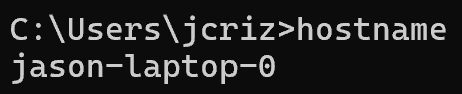
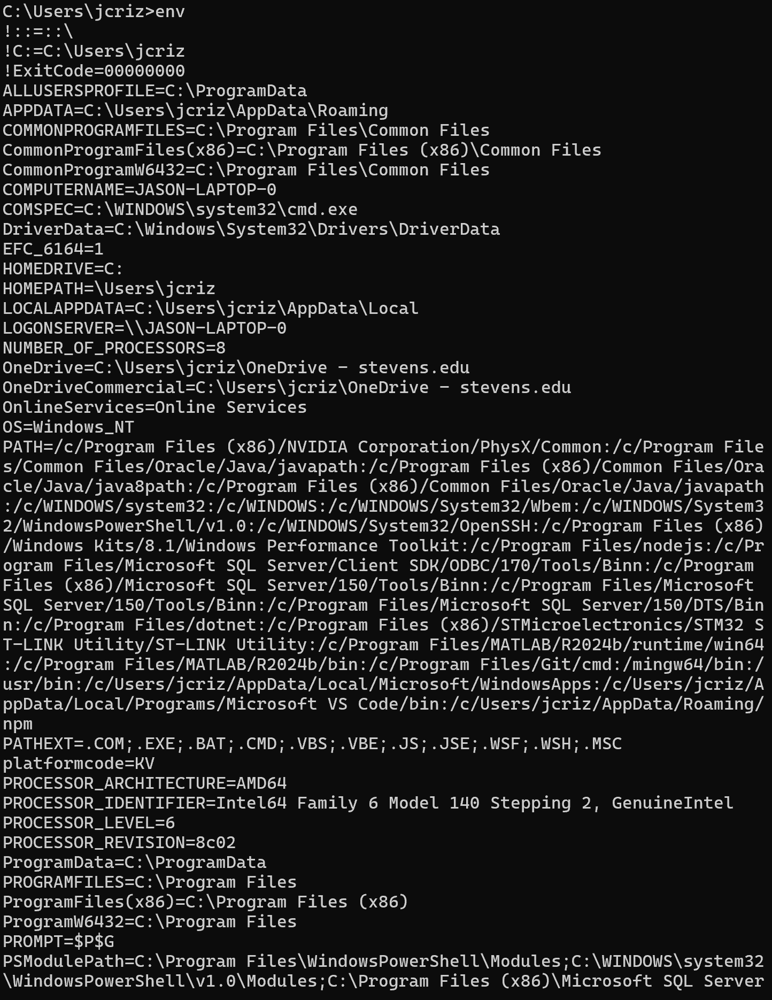
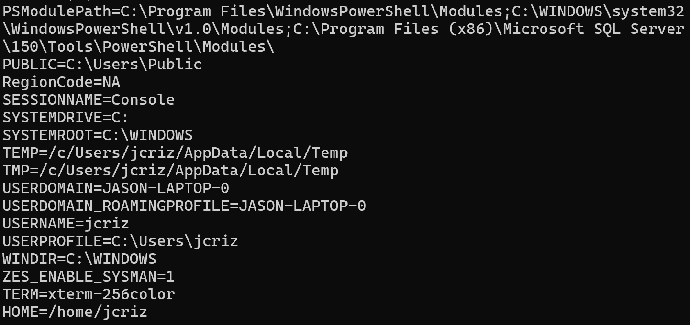
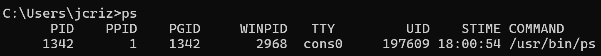
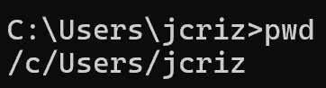
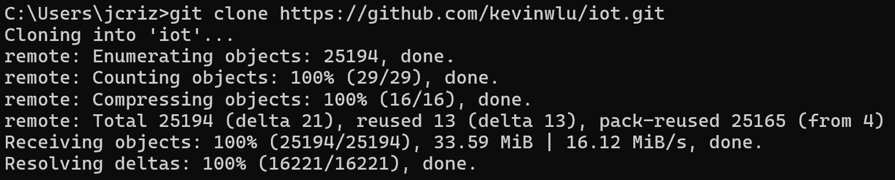
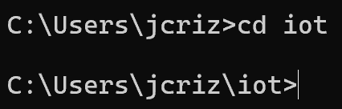

# CPE 322 - Lab 2 
## Command Line 
--- 
### Introduction 
This lab focuses on utilizing some basic standard terminal commands to accomplish basic system, information, and file-related tasks. Most common systems utilize similar commands for their basic command line tasks, so I began by opening a Windows command prompt, as I currently have a Windows system. 

### Commands 
The lab began with the usage of several basic commands. 

#### Command 1: `hostname` 
This simple command returns and displays the hostname of the system, which is its identifying label, as shown below. 

#### Command 2: `env` 
This command displays the environment variables for the system, which control various file paths and processes within the system. 

#### Command 3: `ps` 
This command lists and displays basic information about running processes within the system. 

#### Command 4: `pwd` 
This command displays the path to the current working directory in the command terminal. 

#### Command 5: `git clone` 
This command invokes the Git program to copy a directory from a remote source to the current directory, which in this case is the IOT GitHub repository. Git needed to be installed manually to be utilized within the Windows command prompt, as it is not a common built-in utility on Windows. However, after being installed, the command worked properly and downloaded the IOT repository. 

#### Command 6: `cd iot`
This command sets the current working directory to the directory specified, which in this case is the 'iot' directory. 

