# CPE 322 - Lab 2 
## Command Line 
--- 
### Introduction 
This lab focuses on utilizing some basic standard terminal commands to accomplish basic system, information, and file-related tasks. Most common systems utilize similar commands for their basic command line tasks, so I began by opening a Windows command prompt, as I currently have a Windows system. 

### Commands 
The lab began with the usage of several basic commands. 

#### Command 1: `hostname` 
This simple command returns and displays the hostname of the system, which is its identifying label, as shown below. 

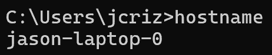

#### Command 2: `env` 
This command displays the environment variables for the system, which control various file paths and processes within the system. 

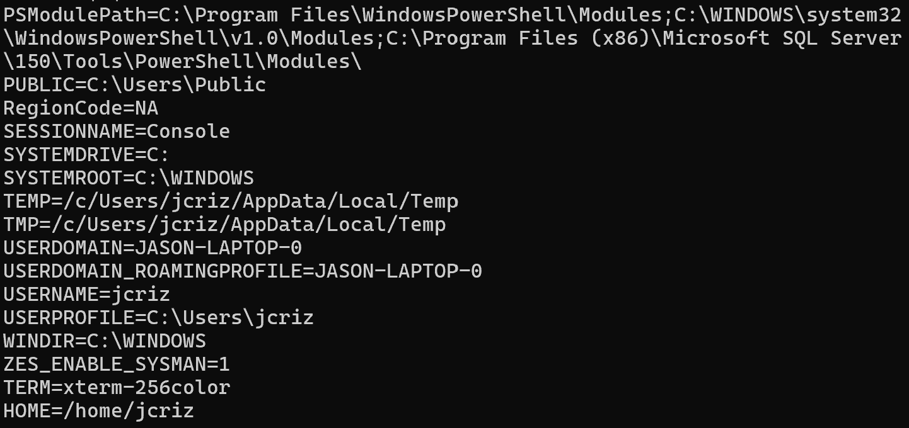

#### Command 3: `ps` 
This command lists and displays basic information about running processes within the system. 

#### Command 4: `pwd` 
This command displays the path to the current working directory in the command terminal. 

#### Command 5: `git clone` 
This command invokes the Git program to copy a directory from a remote source to the current directory, which in this case is the IOT GitHub repository. Git needed to be installed manually to be utilized within the Windows command prompt, as it is not a common built-in utility on Windows. However, after being installed, the command worked properly and downloaded the IOT repository. 

#### Command 6: `cd iot`
This command sets the current working directory to the directory specified, which in this case is the 'iot' directory. 

#### Command 7: `ls`
This command lists the files and other directories within the current working directory. 

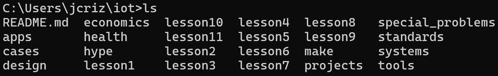

#### Command 8: `cd`
This command, which is 'cd' without any directory path following it, simply lists the current working directory, but in a Windows file path format unlike pwd. Notably, on Unix-based systems, this command will change the directory to the home directory without any arguments. 

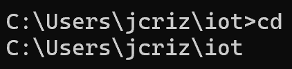 
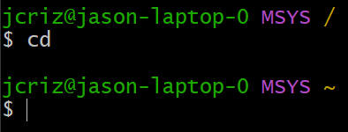

#### Command 9: `df`
This command lists filesystems on the system with basic information, such as storage usage. 

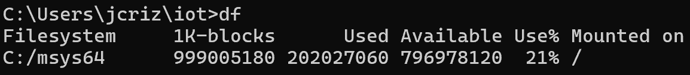 

#### Command 10: `mkdir demo`
This command creates a new directory within the current working directory. In this case, the directory is named 'demo'.  

 

#### Command 11: `cd demo`
The cd command is used again to set the current working directory to the demo directory. 

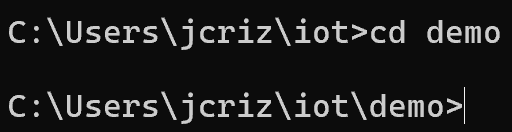 

#### Command 12: `nano file`
This command opens a file in nano, which is a command-line text editor. The text 'file' was written manually into the new file with the text editor, and the file was then saved to the current working directory. 

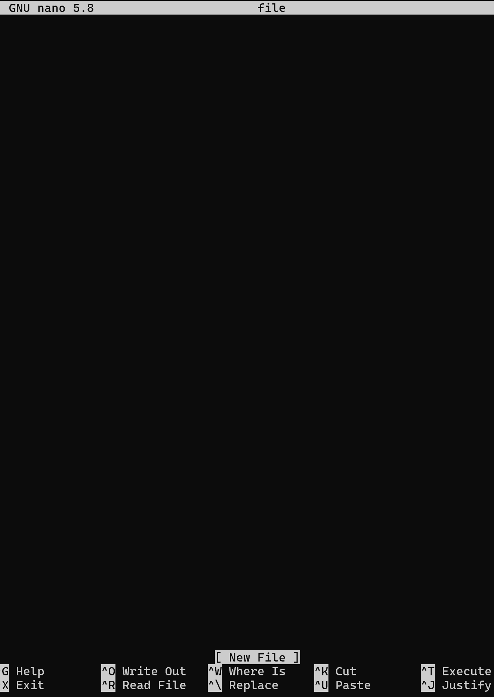 

#### Command 13: `cat file`
This command prints the contents of the file in the arguments, which in this case contained the word 'file'. 

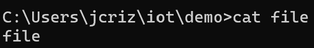 

#### Command 14: `cp file file1`
This command copies the first file argument to the second file argument under the file name in the second argument. After the copy operation, 2 files remained in the directory. 

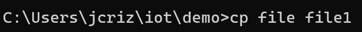 
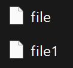

#### Command 15: `mv file1 file2`
This command, usually used to move files, is used in this case to rename 'file1' to 'file2'. After the operation, 'file2' exists in the place of 'file1'. 

 

#### Command 16: `rm file2`
This command removes the specified file. In this case, 'file2' is no longer present after the opeartion. 

 
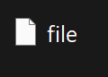 

#### Command 17: `clear`
This command clears all text off of the command window, leaving only a new prompt, notably without resetting the current state of the terminal. 

 

#### Command 18: `man uname`
This command does not exist on Windows or within the Msys Unix-like terminal used for this lab, mainly only functioning on Linux systems. However, the command accesses the "manual" within the system and gives a description for the other command referenced, which in this case is the 'uname' command. The 'help' command within Windows serves a similar purpose. 

#### Command 19: `uname -a`
This command displays some basic system information, such as the hostname, terminal software information, system time, and some other system information. 

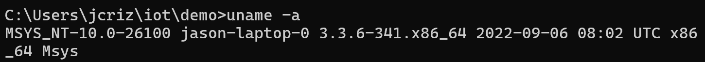 

#### Command 20: `ifconfig`
This command, similarly to the 'man' command, does not exist on Windows or in the Msys terminal. However, this command calls upon a Linux system administration utility, and lists some information about network interfaces connected with the system. 

#### Command 21: `ping localhost`
This command "pings" or sends 4 test packets to the localhost and monitors the responses. This command is used to test network connectivity to a particular destination. 

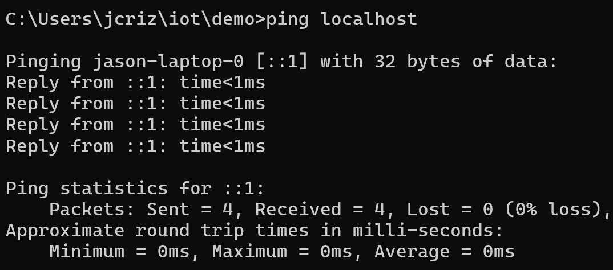 

#### Command 22: `netstat`
This command lists current network connections along with related diagnostic information such as status, address, protocol, and local port. 

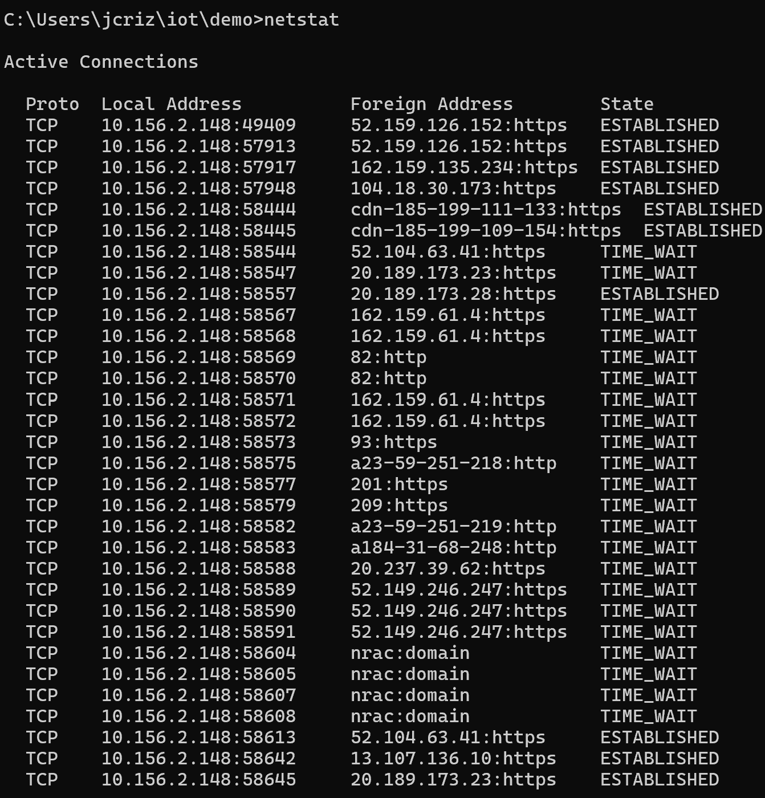 

