# CPE 322 - Lab 3 
## Python 
--- 
### Installation 

Python was already installed on the Windows system used for this lab, and the Python 3 prefix in the terminal was set as "python" instead of the standard "python3." The required packages were also installed using pip, with other unstated dependencies being installed as Python required them to run specific scripts. 

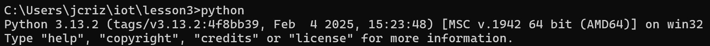 

### Script 1: `julian.py` 

After the installation of Python and the required libraries, the lab tested the installation through running several test scripts. `julian.py` prints the current date, as well as the Julian calendar date and the Modified Julian calendar date for this date. 

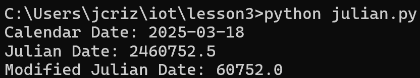 

### Script 2: `date_example.py` 

The second script prints the date in several formats, stating the month, year, and the day of the week, as well as stating the number of days away from the first and last days of classes. 

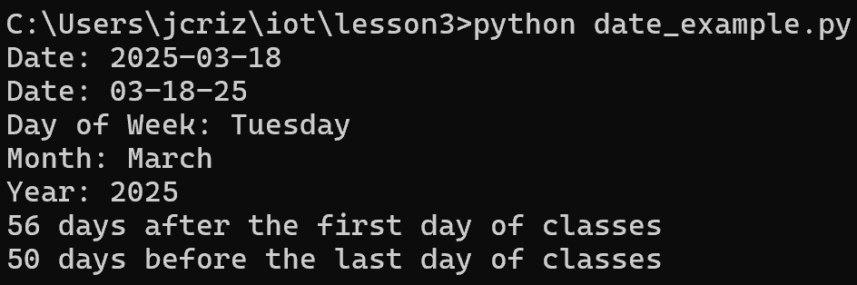 

### Script 3: `datetime_example.py` 

This script prints an extremely precise system date and time several times in the terminal. Notably, the script uses a deprecated function, as warned in the command output. 

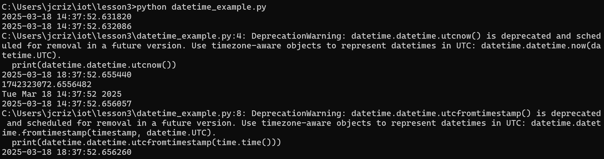 

### Script 4: `time_example.py` 

`time_example.py` repeatedly prints the system date and time as a formatted string every 10 seconds. 

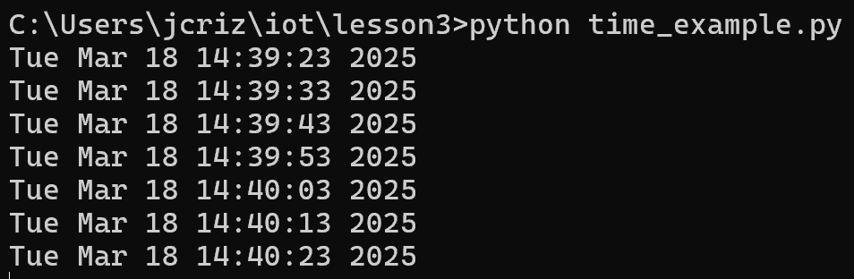 

### Script 5: `sun.py` 

`sun.py` prints the time zone, latitute, longitude, and times for dawn, sunrise, noon, sunset, and dusk for the input location. For this example, the location was selected as "New York." 

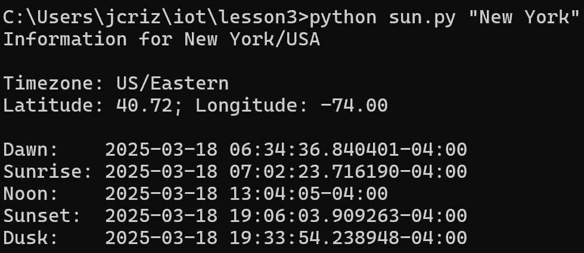 

### Script 6: `moon.py` 

This script prints the numerical moon phase for each day over the next month from the current date. 

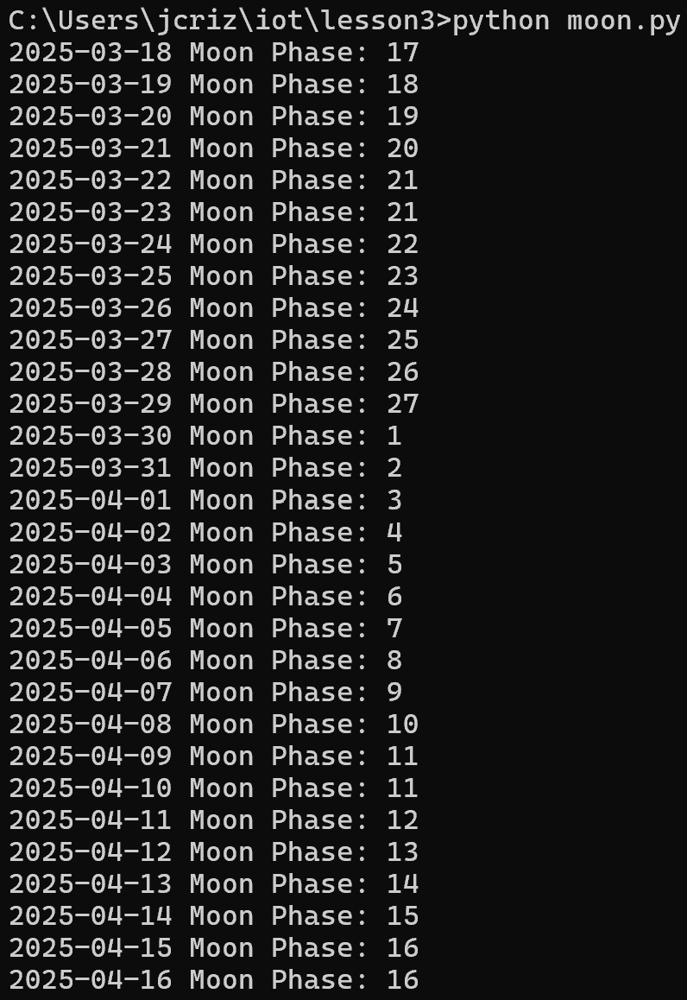 

### Script 7: `coordinates.py` 

This script prints the address and exact latitude and longitude coordinates for the input location. For this example, the input used was "Samuel C. Williams Library." 

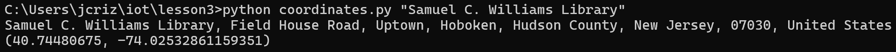 

### Script 8: `address.py` 

`address.py` does the inverse of `ccordinates.py`, taking the input pair of latitude and longitude coordinates and printing the address found at those coordinates. For this example, the input coordinates were those for Stevens Institute of Technology, which was successfully located. 

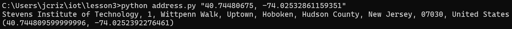 

### Script 9: `cpu.py` 

This script prints the number of physical and logical CPU cores for the system, then repeatedly prints the utilization percentage for each CPU core. 

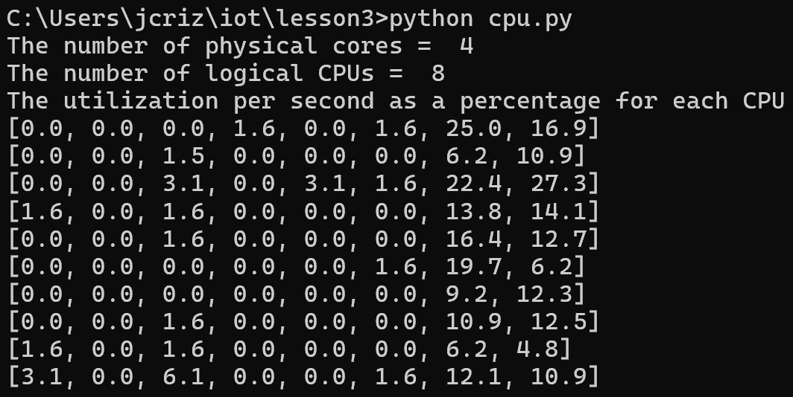 

### Script 10: `battery.py` 

This script prints system battery statistics such as percentage, estimated time remaining for the battery, and charging status. 

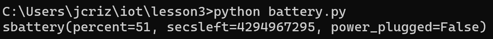 

### Script 11: `documentstats.py` 

This script opens the input document file, and analyzes it, counting its words and returning the total word count and the top 10 most utilized words in the document. 

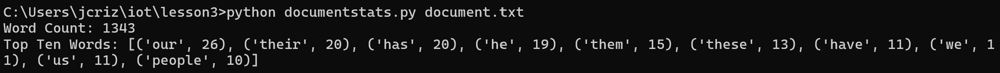 

