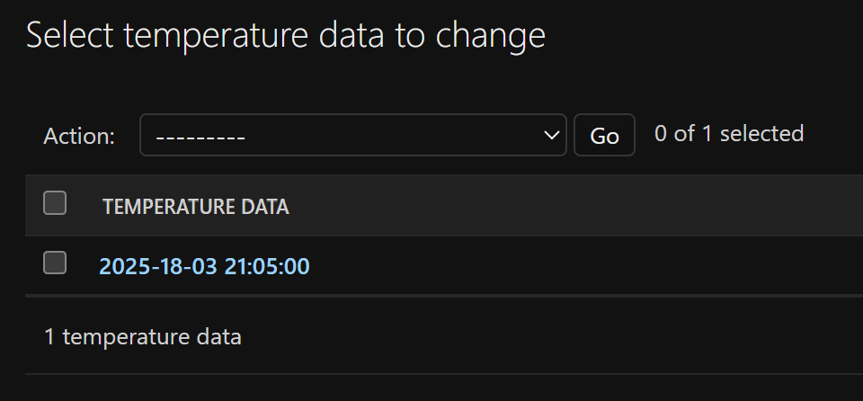
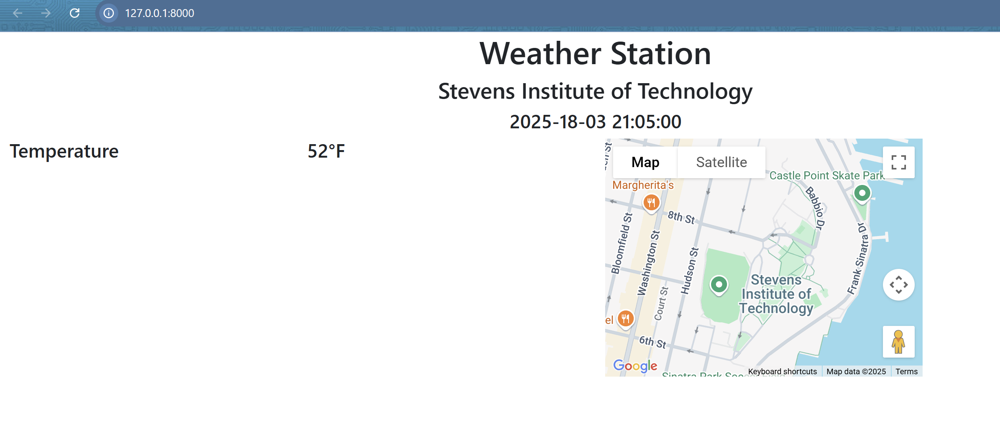
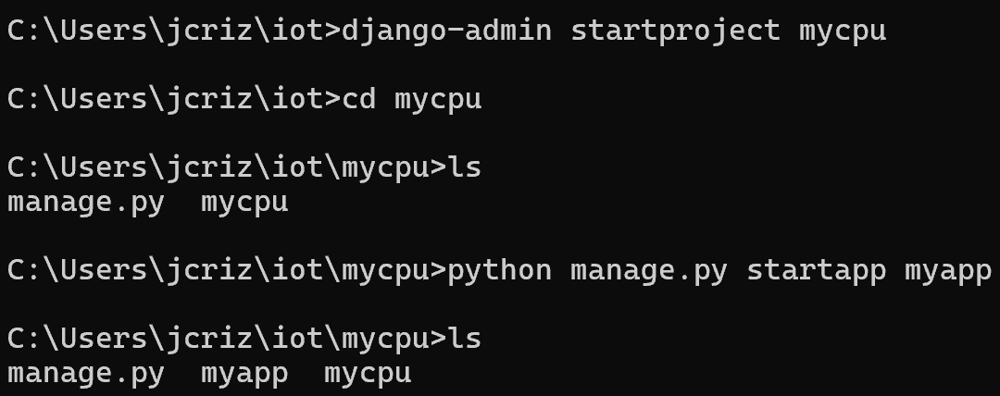
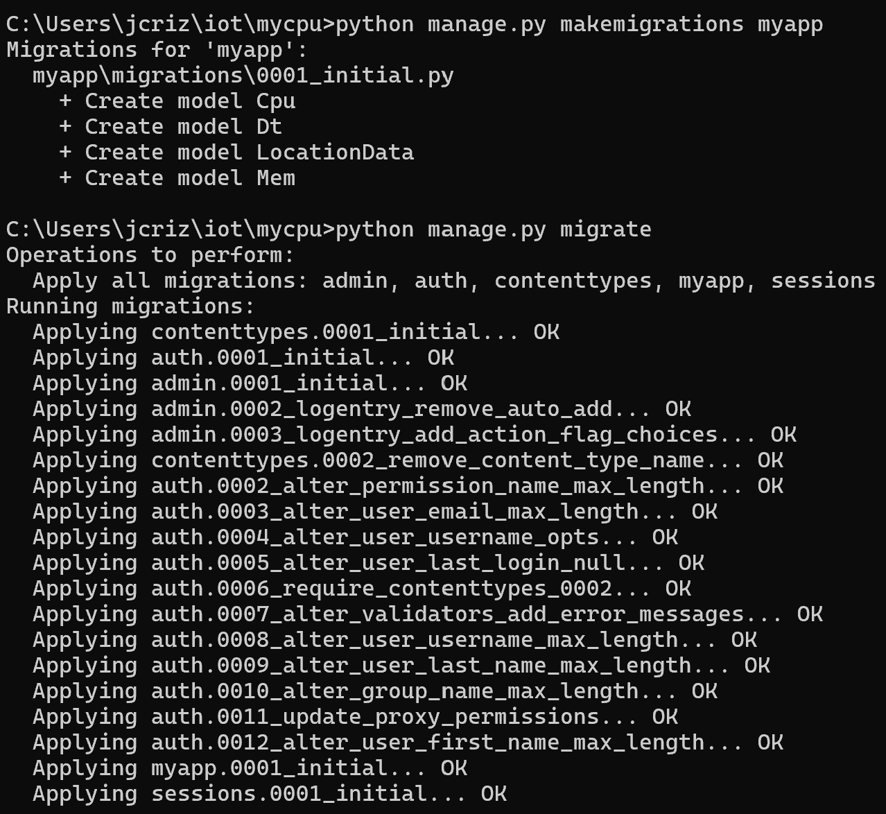
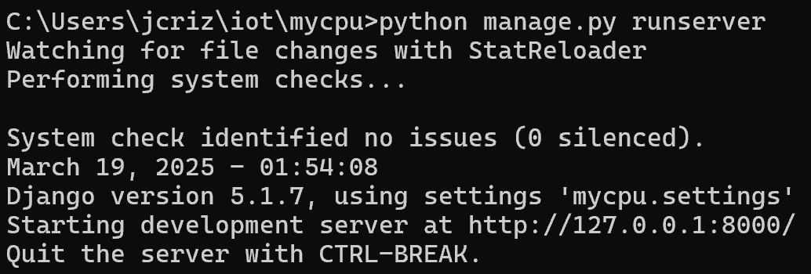
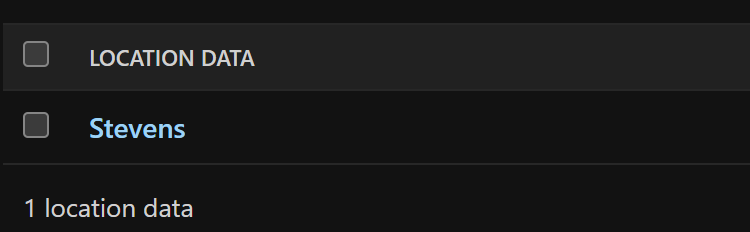
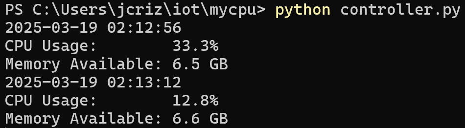
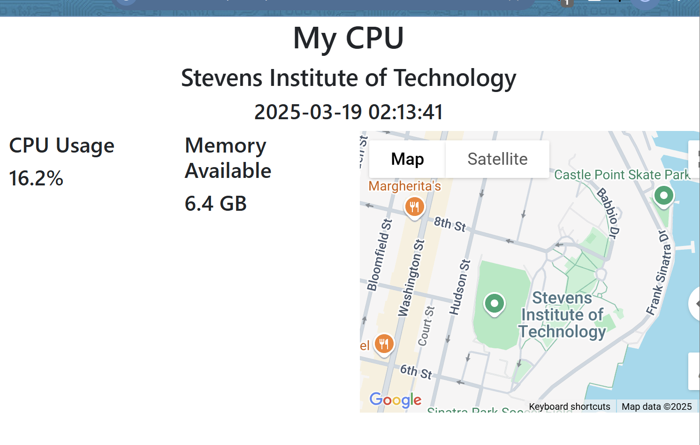

# CPE 322 - Lab 4 
## Django and Flask 
--- 
### Installation 

The required packages for Django and Flask, including the REST framework, were installed using pip similarly to other Python packages. This process was successful, and the packages were installed. 

 

--- 

### Part 1: `stevens` Project 

This lab utilized Django and Flask, along with the Django REST framework, to run web servers on the system using Python, which could then be accessed thruogh a browser. 

The first portion of the lab began with the creation of a project called "stevens." The project was created using the `startproject` command within Django, and a directory was generated to contain the project files. 

 

An app called "myapp" was then created within the project directory through the `startapp` command within Django, which also generated a directory to contain the app's files. 

 

Following this project creation, the proper example files to run the project were copied from the "iot" master directory to their respective locations in the project and app directories, including urls.py, admin.py, models.py, views.py, and index.html. Some files, such as settings.py, were edited to allow the project to run, changing the list of allowed hosts and installed apps to recognize the app within the project. The index.html file had to be edited as well to add a Google Cloud API key, which had to be generated using a Google Cloud account and enabled to access the Google Maps Javascript API. Upon this being completed, the API key would allow access to Google Maps from the webserver. Static files for project functionality were also copied. 

The project was then migrated using the `makemigrations` and `migrate` commands, which allowed the changes made to the models through the app to be updated in the database, which did not need to be manually configured on the Windows system running the server. 

 

A superuser account had to be created to allow the server to be managed remotely after startup. This was completed using the `createsuperuser` command, which prompted the input and confirmation of a username, email address, and password for this user, which were accepted and utilized for the superuser. 

The server was then run using the `runserver` Django command, which used the terminal session to begin running the webserver from the completed project directory. This began successfully. 

 

After starting the server, the superuser account had to be accessed from the admin panel of the server to add the location and temperature data for the app. 

 

The server ran successfully, and when the app was viewed at the local host address, the app displayed the current input temperature, date, time, and location, as well as using the Google Maps API to display this as an interactive embedded Google Map. 

 

--- 

### Part 2: `mycpu` Project 

The second portion of the lab was similar to the first, creating a Django project, with the primary difference being that this project utilized the REST framework and generated an updating webpage app on its server. 

The `startproject` and `startapp` commands were utilized the same way as the first part of the lab. 

 

Following the project creation, the same process of copying files was completed again, with some extra modifications to account for the REST framework. The string "rest_framework" was included as an item in the installed apps list in settings.py, and extra files such as serializers.py and controller.py were copied to the project directory. The default admin password also needed to be changed in views.py and controller.py. The same Google Maps API key was also added to index.html within this project. An attempt was also made to install psutil, but this was already present under the list of packages. 

The project was migrated exactly as it was in the last project. 

 

A superuser was also created using the same process, but the credentials had to match those set in the views.py and controller.py for the app to function. 

The server was then started using the `runserver` command, which succeeded. 

 

The admin page also had to be accessed to input basic data into the database, including coordinates as before, but also, on 3 different subpages of the site, there were fields to input starting data for the functionality of the app, which were initialized to 2024, 20, and 20 respectively. 

 

The controller.py service had to be started in a new terminal window following this. The purpose of this script was to retrieve, print, and update the website with data gathered about the current date, system cpu usage, and system memory usage. 

 

After all of this was running, the app was loaded in a browser window, and it functioned as expected, displaying the same Google Maps embedded window as before, but also displaying a live-updating record of system cpu and memory usage. 

 

