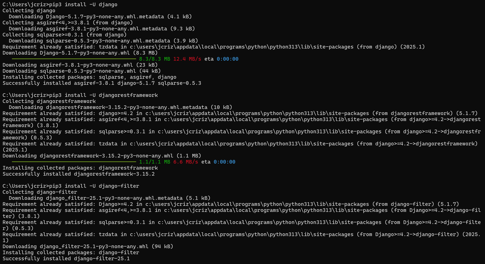

# CPE 322 - Lab 4 
## Django and Flask 
--- 
### Installation 

The required packages for Django and Flask, including the REST framework, were installed using pip similarly to other Python packages. This process was successful, and the packages were installed. 

 

--- 

### Part 1: `stevens` Project 

This lab utilized Django and Flask, along with the Django REST framework, to run web servers on the system using Python, which could then be accessed thruogh a browser. 

The first portion of the lab began with the creation of a project called "stevens." The project was created using the `startproject` command within Django, and a directory was generated to contain the project files. 

 

An app called "myapp" was then created within the project directory through the `startapp` command within Django, which also generated a directory to contain the app's files. 

 

Following this project creation, the proper example files to run the project were copied from the "iot" master directory to their respective locations in the project and app directories, including urls.py, admin.py, models.py, views.py, and index.html. Some files, such as settings.py, were edited to allow the project to run, changing the list of allowed hosts and installed apps to recognize the app within the project. The index.html file had to be edited as well to add a Google Cloud API key, which had to be generated using a Google Cloud account and enabled to access the Google Maps Javascript API. Upon this being completed, the API key would allow access to Google Maps from the webserver. Static files for project functionality were also copied. 

The project was then migrated using the `makemigrations` and `migrate` commands, which allowed the changes made to the models through the app to be updated in the database, which did not need to be manually configured on the Windows system running the server. 

 

The server was then run using the `runserver` Django command, which used the terminal session to begin running the webserver from the completed project directory. This began successfully. 

 

After starting the server, the 

![Adding 

The server ran successfully, and when the app was viewed at the local host address, the app displayed the current input 
