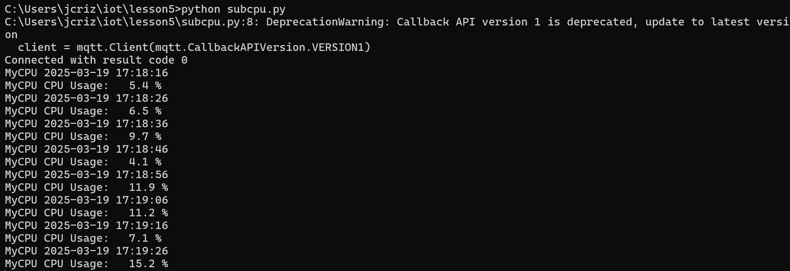

# CPE 322 - Lab 5 
## Paho-MQTT 
--- 
### Installation 

This lab began by installing Paho-MQTT using the same process for installing standard Python packages through the use of pip. This installation completed successfully, as indicated by the terminal. 

 

### Paho-MQTT Functionality 

After Paho-MQTT was installed, the repository was updated using git pull, which completed successfully but did not update files relevant to this lab. 

Two Windows system terminals were then opened, and on each, a different Python script was executed. The first script to be executed was `pubcpu.py`, which periocally published the system's current CPU utilization to the MQTT network. The file `subcpu.py` was then invoked in the second terminal, which connected to the MQTT network and subscribed to the CPU data published by the first terminal. This worked successfully, with the CPU utilization data points published on the first terminal appearing on the second terminal immediately afterwards. 

 

 

