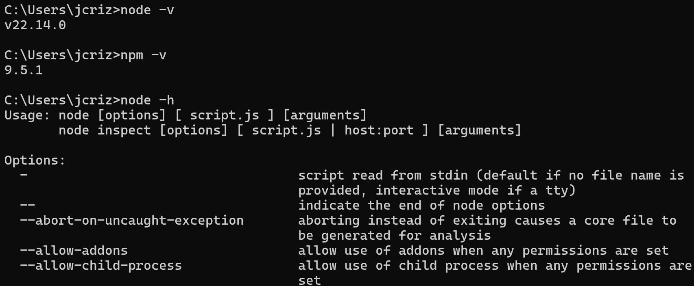
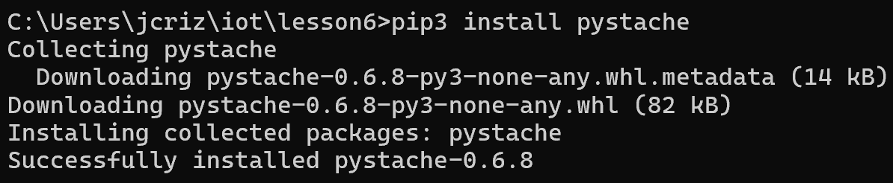
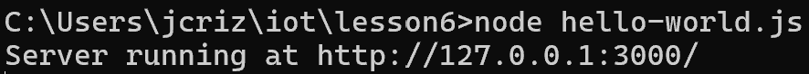
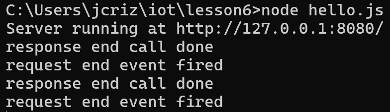
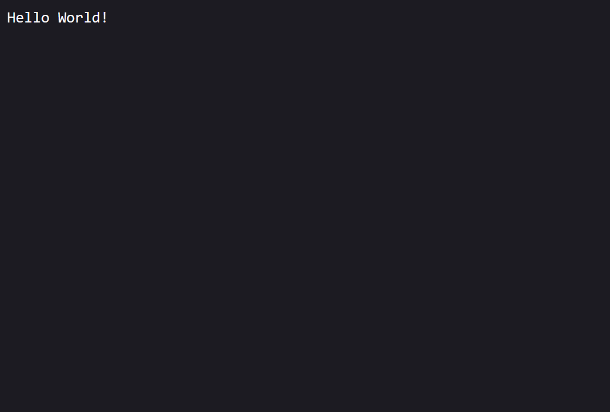
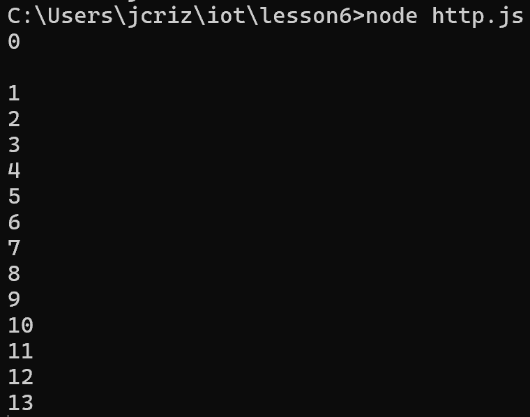
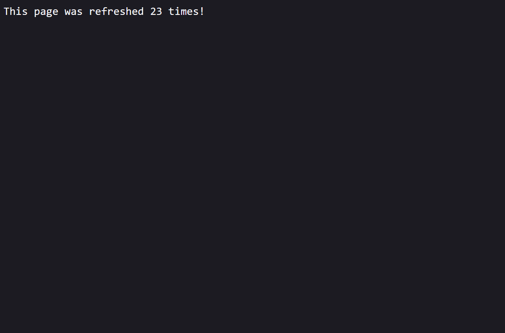
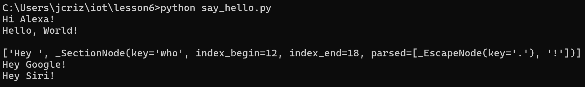

# CPE 322 - Lab 6 
## Node.js and Pystache 
--- 
### Installation 

Node.js was installed by downloading its Windows installer from its website and running it, which installed Node.js and required dependencies in the system. This was successful, and the command line showed the versions of Node.js and its command list. 

 

For the second portion of the lab, Pystache was also installed as a standard Python package using pip. This also succeeded. 

 

### Part 1: Node.js 

For the first part of this lab, Node.js was used to run several Javascript files on a web server to test their functionality. 

The first file, `hello-world.js`, when invoked with the `node` command, generated a simple webpage on the local host on port 3000, which when viewed, displayed the text "Hello, World!" 

 

 

The second file, `hello.js`, was invoked using the same process, and generated a similar simple "Hello World" webpage. However, when this page was accessed, the terminal in which the file was running displayed a message indicating this. 

 

 

The third file, `http.js`, generated a simple webpage that displayed the number of times the page has been refreshed, with the running terminal printing this number as well. The counter updated each time the page was refreshed, and did not reset when the page was closed, incrementing and updating whenever the page was accessed at all. 

 

 

### Part 2: Pystache 

The second portion of this lab required the use of Pystache, which was installed at the beginning, to run a test script, `say_hello.py`. This script used Pystache, which is a Python library implementation of Mustache, to print from a list and format several strings beginning with "Hey." Mustache is a universal template formatting language, which has uses in replacing views and javascript additions to HTML files with its own system for formatting templates, which has applications to website design, such as in this lab and Lab 4. 

 

