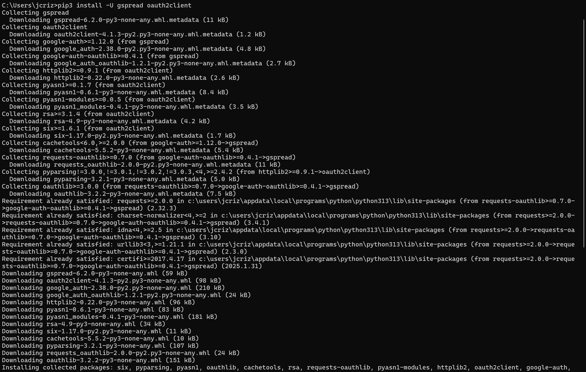
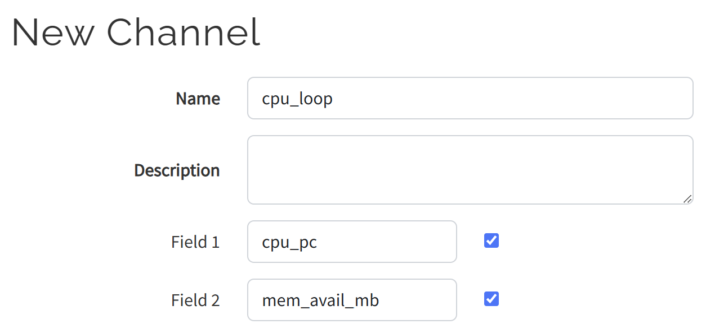
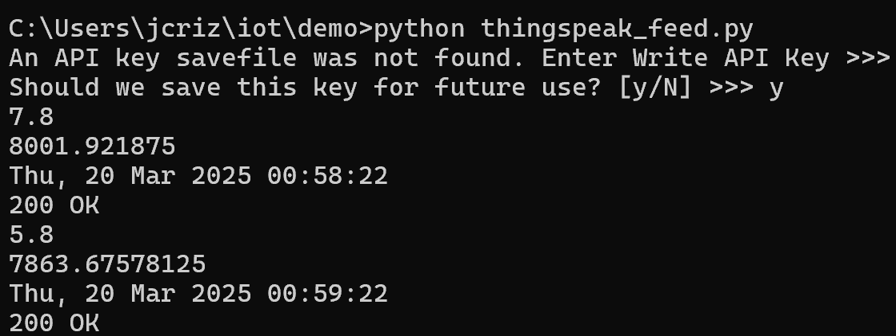
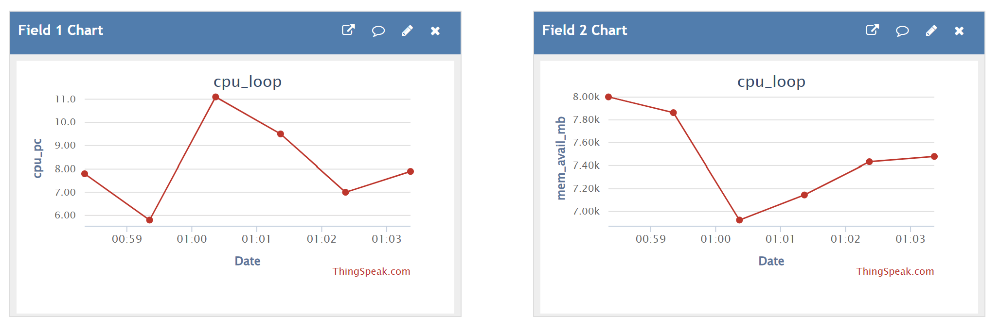

# CPE 322 - Lab 7 
## ThingSpeak and Google Sheets 
--- 
### Installation 

The only software that needed to be installed for this lab was oauth2client for the Google Sheets portion, which was installed using pip like a standard Python package. This installation was successful. 

 

### Part 1: ThingSpeak 

The first portion of the lab focused on using ThingSpeak, a MathWorks cloud data analysis platform, to collect and graph system CPU and memory usage data. A MathWorks account already existed for use with MATLAB, so this was logged into on ThingSpeak, and a new channel `cpu_loop` was created, with channels `cpu_data` and `mem_avail_mb` to log and graph the current CPU usage percent and the current memory usage. 

 

The required Python files, `thingspeak_cpu_loop.py` and `thingspeak_feed.py` were placed into a demo folder, and the `thingspeak_feed.py` file was executed in Python. The API key for ThingSpeak was requested, so it was copied from the ThingSpeak site and placed in the text field and saved. The program then began printing and uploading the system CPU and memory data to the ThingSpeak server, which then graphed these data points on two graphs on the ThingSpeak site. 

 

 

### Part 2: Google Sheets 

The second part of this lab 
