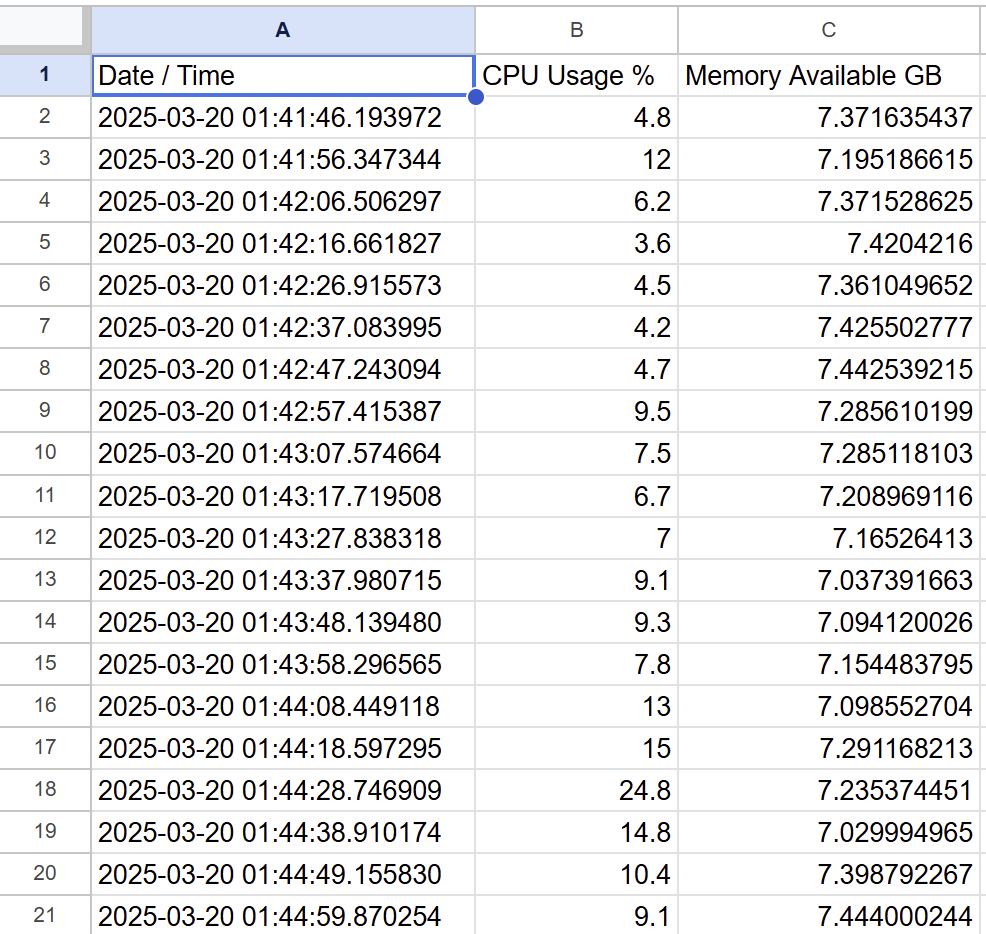

# CPE 322 - Lab 7 
## ThingSpeak and Google Sheets 
--- 
### Installation 

The only software that needed to be installed for this lab was oauth2client for the Google Sheets portion, which was installed using pip like a standard Python package. This installation was successful. 

 

### Part 1: ThingSpeak 

The first portion of the lab focused on using ThingSpeak, a MathWorks cloud data analysis platform, to collect and graph system CPU and memory usage data. A MathWorks account already existed for use with MATLAB, so this was logged into on ThingSpeak, and a new channel `cpu_loop` was created, with channels `cpu_data` and `mem_avail_mb` to log and graph the current CPU usage percent and the current memory usage. 

 

The required Python files, `thingspeak_cpu_loop.py` and `thingspeak_feed.py` were placed into a demo folder, and the `thingspeak_feed.py` file was executed in Python. The API key for ThingSpeak was requested, so it was copied from the ThingSpeak site and placed in the text field and saved. The program then began printing and uploading the system CPU and memory data to the ThingSpeak server, which then graphed these data points on two graphs on the ThingSpeak site. 

 

 

### Part 2: Google Sheets 

The second part of this lab began by creating a new Google Cloud project called `cpudata`, on which the APIs for Google Drive and Google Sheets were enabled. A service account was created instead of an API key for this project, which allowed operations as a user to be automated on a Google Sheet. Ther service account's key was downloaded as a `.json` file, and this file and the `cpu_spreadsheet.py` file were copied to a demo directory. 

A new Google Sheet called `cpudata` was created on the primary Google account, and all rows except the first row were deleted, with the first row having header data input into it. The spreadsheet was then shared with an email address associated with the service account from the key `.json` file. Allowing this account edit access to the file would allow the service account to edit the file through calls to the API. 

The file `cpu_spreadsheet.py` was then run from the demo directory, and it began gathering, printing, and uploading system CPU usage and memory data. This data was placed into the `cpudata` spreadsheet in new rows by the program through the service account connected to the Google Cloud API. 

 

 

