# CPE 322 - Lab 8 
## Data Analysis 
--- 
### Installation 

A large number of data analysis packages needed to be installed for this lab's projects to function properly, so these were all installed as Python packages through pip. Notably, the `tensorflow` package did not install on the latest Python 3.13 build used for the other labs, so this lab was completed by installing an older build of Python 3.11, which was compatible with the most recent version of TensorFlow. After the Python version was changed, the installations completed successfully. 

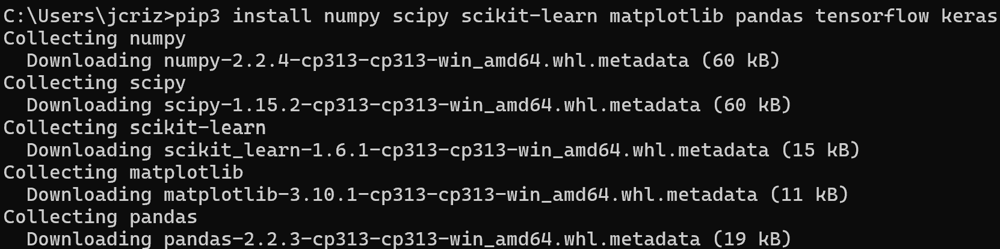 

### Testing 

The installation was tested by running some of the example Python scripts provided. These included the Titanic data analysis scripts and the traffic data analysis script. 

The file `titanic_1.py` analyzed the data set of Titanic survivors, printed the percentages of surviving female and male passengers, and generated a graph showing the number of passengers in each class. 

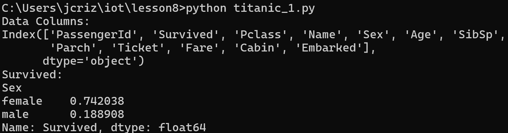 

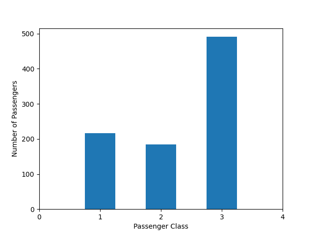 

The file `titanic_2.py` analyzed the same data set, but analyzed the percentages of survivors from female and male categories, while also sorting those categories into classes and fare subclasses from those classes. 

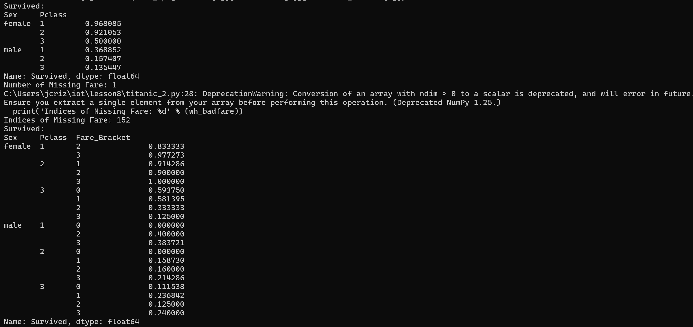 

The file `traffic.py` analyzed a traffic data set, generating a table of machine learning evaluation statistics, including precision, recall, f1-score, and support values for the accuracy, macro average, and weighted average for the traffic data set. 

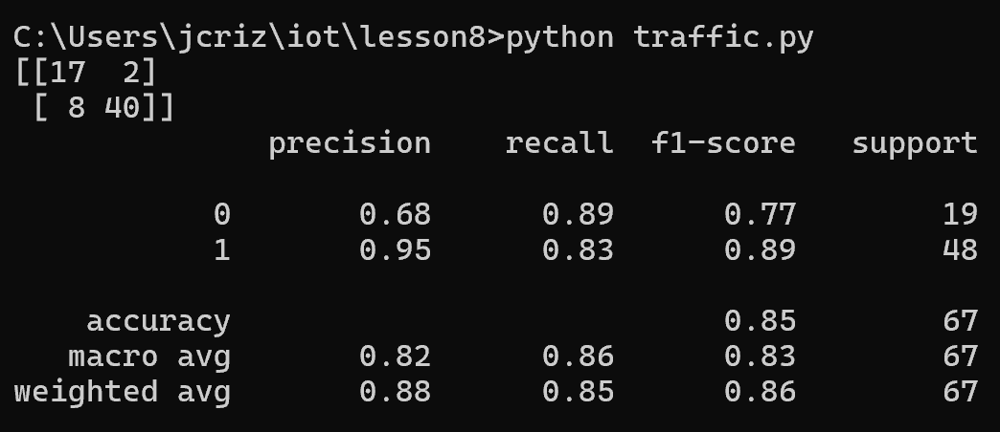 

### Data Analysis 

The dataset to be analyzed for the major portion of this lab was the `cpudata` dataset from the previous lab. To begin, 4 graphs were made directly on the Google Sheet using Google Sheets' built-in tools for generating graphs and analyzing data. 

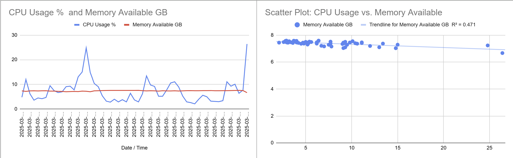 
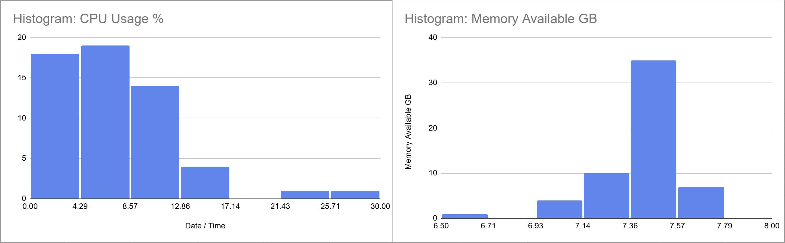 

The data from the Google Sheet was then downloaded as a .csv file to be analyzed and graphed by Python scripts. 

The files `plt_cv2.py` and `plt_final.py` needed to be edited to allow them to open the correct .csv file and graph the correct series of data, as the second data point collected was available memory instead of temperature. The plots and their axes were then named internally in the Python scripts. These scripts were then executed successfully, as shown. 

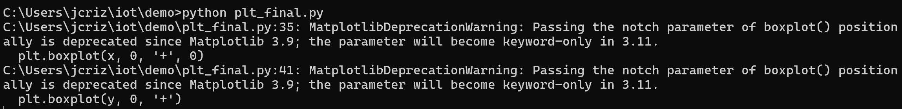 

 

These scripts generated a total of 7 resulting graphs analyzing the CPU dataset. 

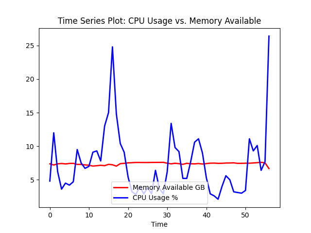 

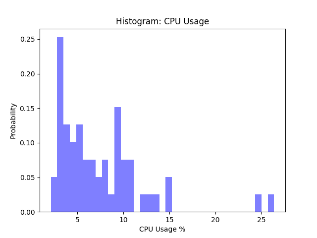 

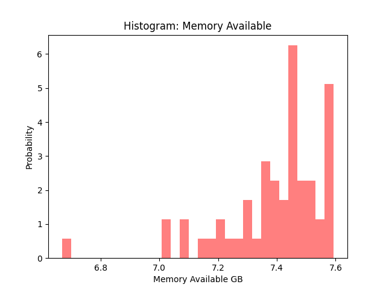 

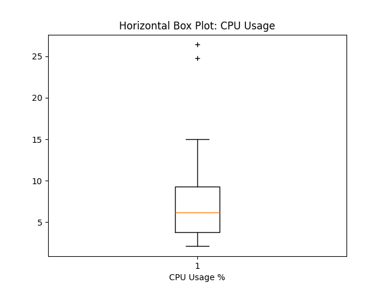 

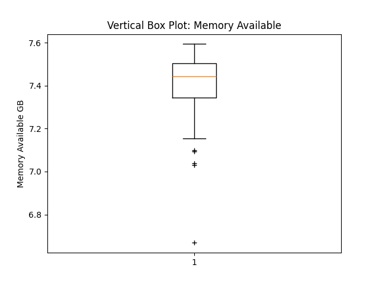 

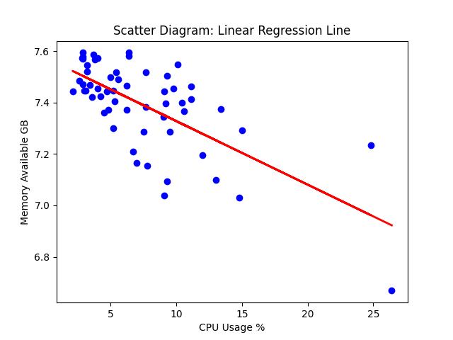 

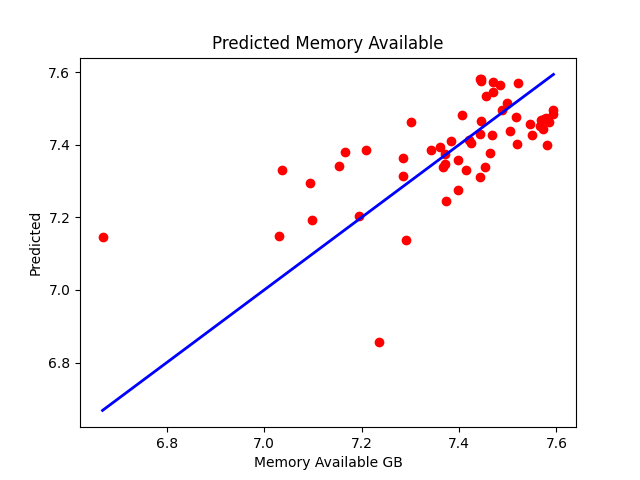 

