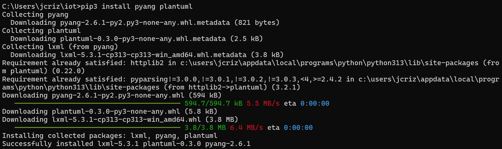
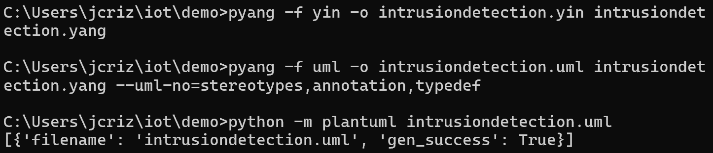
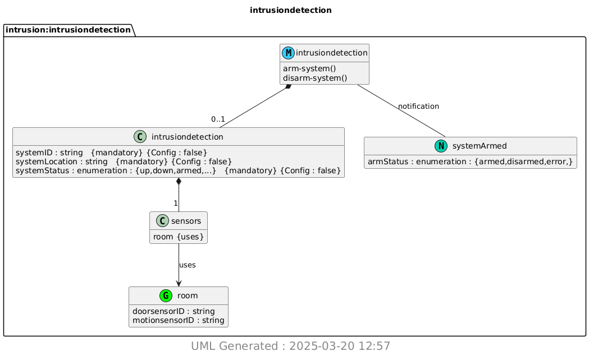

# CPE 322 - Lab 9 
## YANG 
--- 
### Installation 

This lab required the installation of 2 Python packages, installed through pip like standard Python packages. This installation was successful, as shown. 

 

The lab began by copying the `intrusiondetection.yang` file to the demo directory. Once the file was present in the directory, it was invoked thorugh several commands, which converted the .yang file to a corresponding .yin file, then converted the .yin file to a .uml file. This was done to convert the YANG data model code into a universal format (UML). The command line indicated the success of this process, and the necessary intermediary files were generated in the demo directory. 

 

After the .uml file was generated, it was invoked through PlantUML to visualize the data model as a .png image, which was also successful, and the final visualized data model image is shown. 

 

